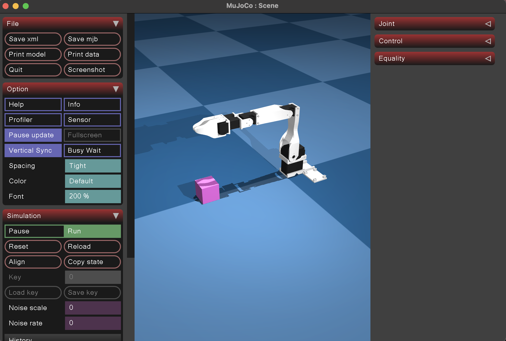

How to install the env:
```
conda create -n mujoco_env python=3.10 -y
conda activate mujoco_env`
pip install --upgrade pip
pip install mujoco
conda install opencv-python
conda install gymnasium

```
To view the model use
```
cd low_cost_robot_arm
python -m  mujoco.viewer --mjcf=scene_box.xml
```
This is how the intial model should look like. 


Mujoco environment of s101 is added in `mujoco_gym_env.py`
This enviroment is called by another environment that has the step  and reset functions. 
we can test this using. 
``` 
mjpython robot_infra/env/PickBoxS101env.py
```
The output of running the environment should look like sim running for a bit before shuttign down. 
